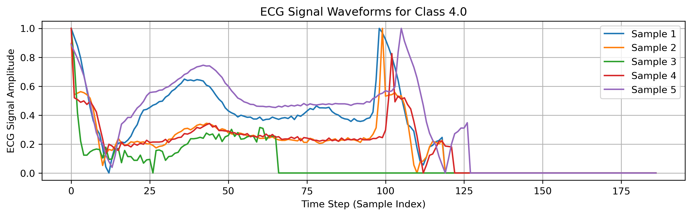
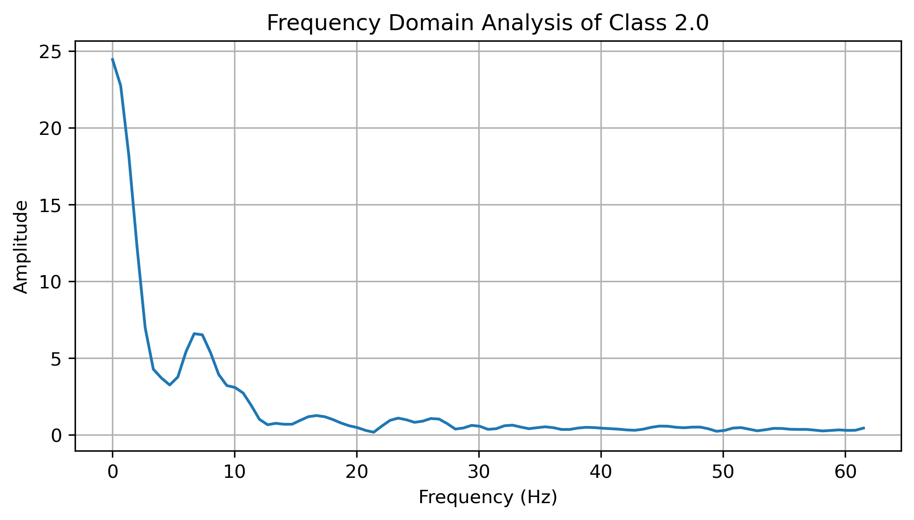
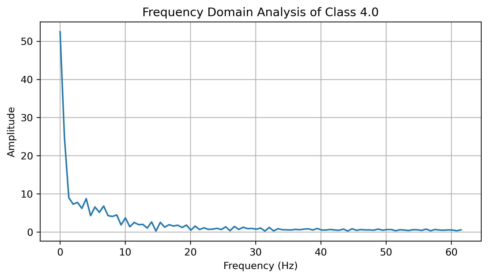
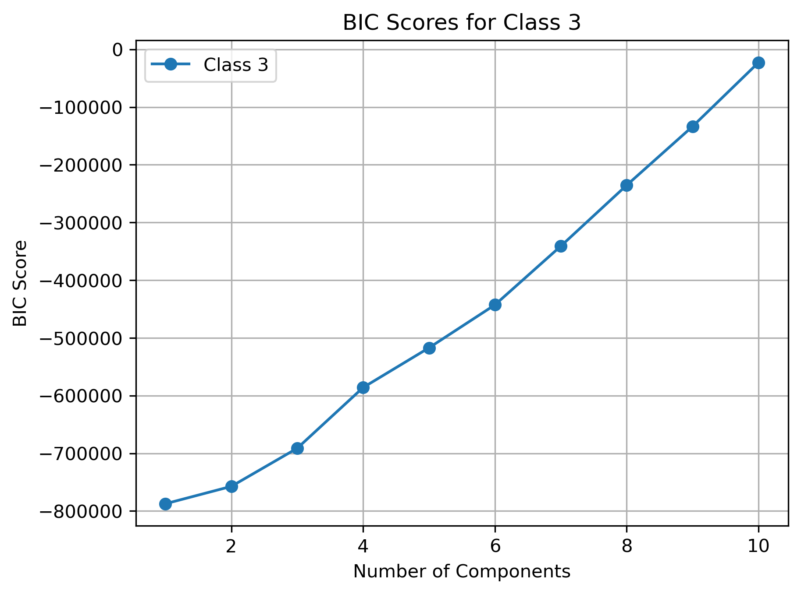

# Results

## Exploratory Data Analysis (EDA)

Before training the models, I performed an in-depth EDA and feature analysis to understand the dataset and evaluate potential feature engineering techniques.

### Key EDA Steps:
#### Visualization:
 - Plotted raw ECG signals to observe waveform patterns.
 - Used bar plots to analyze the class distribution, revealing significant class imbalance.
 - Applied Principal Component Analysis (PCA) and t-SNE to visualize how the high-dimensional ECG  signals cluster in 2D space.
 - Observed that ECG signals are sequential, meaning each data point depends on preceding and succeeding points.

 
 
 

 
 
 
 
 
 

#### Autocorrelation Analysis:
 - Analyzed temporal dependencies within ECG signals.
 - Identified patterns that could be leveraged for feature extraction.

  
  
  
  
  
 

#### Frequency-Domain Analysis:
 - Considered extracting frequency domain features using FFT for feature engineering.
 - Found that further dimensionality reduction techniques were required to make frequency-based features useful.

 
 
 
 
 
 

#### Handling Missing or Zero Values:
 - Replacing zeros with row-wise means or class-wise means reduced accuracy, suggesting that zeros might carry meaningful information in ECG signals, for example when the sensors were disconnected. 
 - Since there were no NaN values, imputation was not necessary.

#### Findings from EDA:
 - Classes 1, 2, and 3 are significantly underrepresented, highlighting the need for data augmentation.
 - The dataset is highly imbalanced, leading to poor classification performance for minority classes.
 - Feature extraction from the frequency domain required further exploration and dimensionality reduction.

## Classification Without Augmentation

### Baseline Model Performance:
Due to the severe class imbalance, the CNN-LSTM model achieved high overall accuracy but performed poorly in classifying minority classes.

#### Major Observations:
 - The model performed well on Class 0 since it had significantly more samples.
 - Minority classes (1, 2, and 3) were often misclassified as Class 0.
 - On the noisy holdout set, classification precision dropped further but not drastically.

  
 

 
 
 

- Validation Accuracy: 42%
- Test Accuracy: 90%
- Holdout Set Accuracy (Noisy Data): 90%

## Augmentation Using Resampling (Upsampling Minority Classes)

- Used sklearn.utils.resample to increase the number of samples for underrepresented classes.
- A sample of generated signals for Class 1 is shown below.

 
 

#### Augmentation Strategy:
 - Class 3: 6,500 additional samples
 - Class 1: 20,000 additional samples
 - Class 2: 50,000 additional samples

Beside, the dataset grew by 1.5 times after augmentation using adding noisde, time shifting and scaling. Below are the results:

  
 
   

- Validation Accuracy: 74%
- Test Accuracy: 91%
- Holdout Set Accuracy (Noisy Data): 91%

## Augmentation Using Gaussian Mixture Model (GMM)

- Used GMM to generate synthetic ECG samples for minority classes.
- Selected the optimal number of components using Bayesian Information Criterion (BIC).

### Generated samples:
- Class 3: 6,000
- Class 1: 4,000
- Class 2: 1,500

### BIC Score Analysis:

  
 
 

 

  
 
   

- Validation Accuracy: 52%
- Test Accuracy: 93%
- Holdout Set Accuracy (Noisy Data): 93%

While overall accuracy was high, minority classes still suffered from misclassification.

## Augmentation Using Generative Adversarial Networks (GANs)

### To generate realistic ECG signals, I trained a GAN-based time-series generator.

- Class 3: 6,500 generated samples
- Class 1: 20,000 generated samples
- Class 2: 50,000 generated samples

  
 
   

### GAN Training & Results:

- Trained on imbalanced ECG signals.
- Evaluated synthetic signals to ensure realism.
- Augmented training data improved classification performance.

 

 

 
 
 

- Validation Accuracy: 50%
- Test Accuracy: 92%
- Holdout Set Accuracy (Noisy Data): 92%

## Conclusions & Next Steps:

The upsampling model performed the best among the approaches tested. In contrast, both GAN-based and GMM-based models generated highly noisy samples, leading to poor performance. The GAN model was implemented using code adapted from this [repository](https://github.com/dumplingman0403/ECG-GAN/tree/main), but the generated samples introduced significant artifacts, reducing overall model reliability. The test set accuracy closely matched that of the hold-out set, indicating strong generalization. This consistency was achieved through random augmentation techniques, including scaling, adding noise, and time shifting, which helped the model learn more robust features while maintaining the integrity of the original data distribution.

- Further exploration of frequency-domain features & dimensionality reduction could enhance results.
- Ensemble models & additional augmentation strategies could further improve minority class performance.