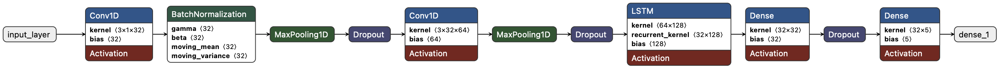

# Code Overview

This repository contains various implementations for ECG signal processing, augmentation, classification, and dimensionality reduction.

## Source Files

### `gan_time_series_generator.py`:
 + Implements a fully functional Generative Adversarial Network (GAN) for ECG signal generation.
 + Allows training on real ECG signals and generating synthetic samples.
### `data_augmentation.py`:
 + Implements augmentation techniques such as time shifting,       scaling, and adding noise to enhance dataset variability.
### `class_data_resampler.py`:
 + Provides a resampling-based augmentation approach using `sklearn.utils.resample`, balancing class distributions for improved training.
### `dimensionality_reduction.py`:
 + Implements Principal Component Analysis (PCA) and t-SNE for feature reduction and visualization of ECG signal clusters.
### `generate_synthetic_data_gmm.py`:
 + Implements Gaussian Mixture Models (GMM) for generating synthetic ECG signals, approximating real data distributions.
### `cnn_lstm_classifier.py`:
 + Implements a CNN-LSTM hybrid model for ECG classification.
 + Features batch normalization, dropout regularization, and early stopping to prevent overfitting.
 + Includes hyperparameter tuning for optimal model performance.

## CNN-LSTM Model Architecture

  

The CNN-LSTM hybrid model is designed for ECG time-series classification, leveraging convolutional feature extraction and sequential pattern recognition.

## Model Layers:
- 1. Convolutional Layers (Conv1D) Extract local spatial features from ECG signals. Kernel size = 3 allows the model to capture small waveform variations.
- 2. Batch Normalization Stabilizes training and accelerates convergence.
- 3. MaxPooling1D Reduces dimensionality while preserving key features.
- 4. Dropout Layers Prevents overfitting by randomly deactivating neurons during training.
- 5. LSTM Layer Captures long-term dependencies in ECG signals, essential for detecting irregularities.
- 6. Fully Connected (Dense) Layers with Regularization Enhances learning capacity while preventing overfitting using L2 regularization.
- 7. Softmax Output Layer Provides multi-class classification, assigning probabilities to different ECG signal types.
## Why This Model?
- CNN layers extract spatial features from ECG signals.
- LSTM layers capture temporal dependencies, making it ideal for time-series classification.
- Augmentation & Resampling improve training on imbalanced data.

This model effectively classifies ECG signals by leveraging both feature extraction and sequential learning, ensuring robustness against noisy and imbalanced datasets.